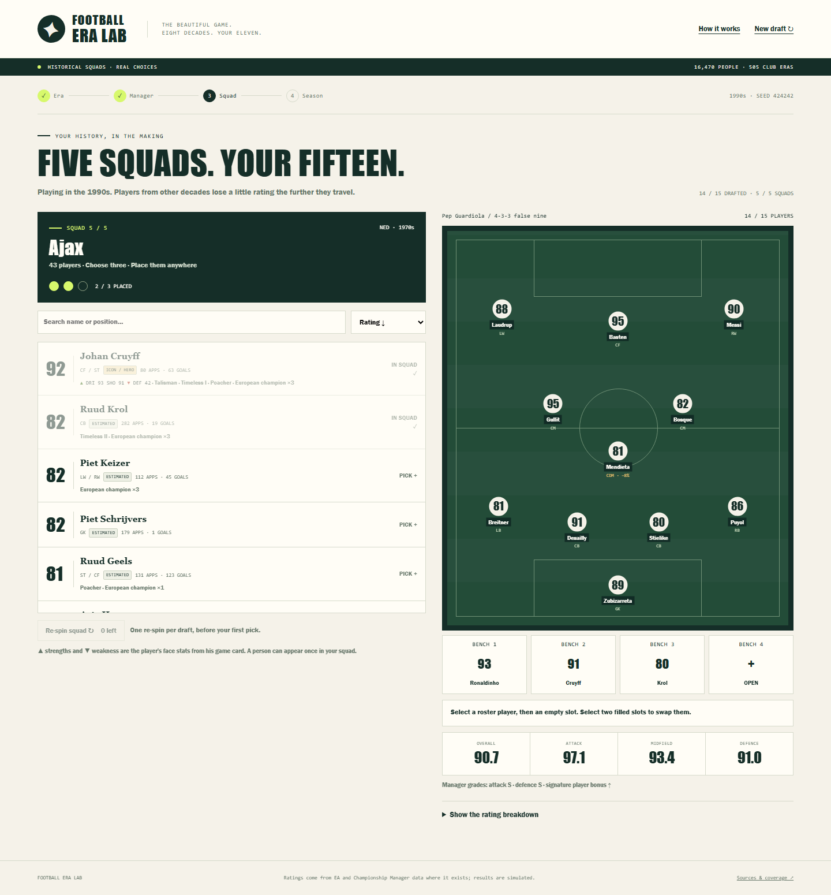

# Football Era Lab

Football Era Lab is a draft game about building a team across generations. Maradona's Napoli card can play alongside Messi's Barcelona card, but you still have to find a goalkeeper, fill the manager's formation and leave four useful substitutes on the bench. The team then plays a season against the leading club squads of your chosen decade.

[Play in your browser](https://symonyeal.github.io/Football-Era-Lab/). The game uses bundled data and needs no account, API key, package installation or separate source downloads.



## Five clubs supply your fifteen players

Start by choosing where the season takes place: one of eight decades from the 1950s to the 2020s. This sets the opposition and the conditions your players will face. It leaves the draft open to every era.

The first draw gives you five manager and formation combinations. You can re-spin twice before keeping one. The formation fixes the eleven starting positions you must fill; the manager also has attacking and defensive grades, and selecting one of his signature players improves those grades.

Then you draw five club squads and choose three players from each. A squad belongs to a club and a decade, such as Napoli in the 1980s. Every available player from that squad appears in the roster. Click a player, then an empty place on the pitch or bench. You have one squad re-spin for the whole draft, usable before making a pick from that draw.

This makes each selection depend on what the team still needs. Three outstanding forwards from the first club may leave you looking for defenders later. A reserve goalkeeper costs a place that could have gone to another attacker, but gives you cover when the starter misses a match. The draws favour strong club squads and eras close to the season you chose, while keeping every decade available.

A footballer may have several cards at different clubs or ages. Those cards are versions of the same person, so choosing one rules out the others during the draft. Once all fifteen places are filled, you can swap any two players and inspect the rating breakdown before kick-off.

## The card belongs to a player, a club and a decade

The club and decade matter because the game uses the version of a player recorded there. An overall rating gives a starting point; the position you assign him changes the contribution he can make.

The bundled Maradona card for Napoli in the 1980s has an overall rating of 91.2, an attacking-midfield rating of 91 and a right-back rating of 71. Putting him at right back therefore gives you 71 before time and teammate adjustments. His name and overall rating do not erase that positional cost. The browser shows the loss before you place him.

Where available, these position ratings come from EA FIFA/FC data or Championship Manager attributes converted to the same rating scale. Cards also show six attributes, such as pace, shooting and passing, so you can see their strengths and weaknesses. Older cards without those measurements use a simpler penalty based on the distance from their listed positions. Every card carries a source label.

Taking a player out of his own era applies another adjustment. Older players lose 3% per decade when moved forward in time; newer players lose 1.5% per decade when moved back. Timeless tags reduce that loss. These are declared game rules, intended to make the choice of era affect the draft. They do not measure how a real footballer would adapt to another generation.

Teammate links can recover some points. Players from the same club and decade earn a bonus when placed near each other, and listed football partnerships earn a larger bonus when both start. The formation distributes the resulting ratings between attack, midfield and defence. Moving a player can therefore affect his own rating, his links and the balance of the team. The [model document](docs/MODEL.md) gives the complete calculation and its limits.

## A season tests the whole squad

Your team joins nineteen club squads from the chosen decade in a twenty-club league. Those opponents are selected from domestic and European results, then field their best elevens under the game's rating rules. Everyone plays home and away. Your team has 38 league matches, and the game also simulates the other clubs' fixtures to produce the full 380-match table.

Alongside the league is a sixteen-club European Cup: your team and the fifteen highest-rated opponents in that field. Ties have two legs through the semi-finals and a neutral final. There is no away-goals rule; extra time and penalties decide level ties. The same competition formats apply to every decade, so these are fictional seasons rather than reconstructions of historical tournaments.

The match model compares each side's attack, midfield, defence and goalkeeper to calculate an expected goal total. It then draws a score around that expectation. A stronger team is favoured, but can lose an individual match. Players can miss matches, starters tire, and the engine makes substitutions when a reserve offers more than a tired starter. This gives the four bench places a job beyond raising the headline squad rating.

The model's goal calculations were fitted to real club results from 2014 to 2019 and checked on separate seasons from 2020 to 2023. That check concerns modern club teams. The era adjustments, manager grades and teammate bonuses remain game rules, and the fit does not establish that a mixed-era eleven has a historically correct strength.

Recorded goals, assists and expected goals also help choose who receives a simulated goal or assist. Expected goals, or xG, describe the chances a player had; expected assists, or xA, describe the chances his passes created. The game uses those records where they exist and falls back to other scoring records or position-based estimates. The scorer, assist and clean-sheet awards in your results come from the matches that were simulated. [Validation](docs/VALIDATION.md) explains what was tested and what the measurements can support.

## The Gauntlet develops the team you drafted

After the season, the Era Gauntlet takes your fifteen through all eight decades, starting in the 1950s. Each decade has two six-match segments, followed by a single knockout match against its highest-rated club in the selected opposition field.

The board starts with 8 patience, with a maximum of 20. Good segments can earn more; poor segments and lost boss matches cost it. You can retry a lost boss while patience remains. The run ends when patience reaches zero or you beat the final boss of the 2020s.

After each completed segment you choose a reward. A boost upgrades an existing player to that same person's highest-rated card in the archive. A free-agent offer lets you sign one player and release another. Development adds a playing tag, such as Talisman, Maestro or Rock. Rest recovers patience, although repeated rests pay less. Upgrades and signings spend patience, so a stronger squad can leave you with less room to survive the next loss.

This follows the reward and board-patience loop of Eraball, adapted to six-match football segments. The full reward costs, squad limits and patience rules are in [MODEL.md](docs/MODEL.md#era-gauntlet).

## Take the same squad into other competitions

The tournament circuit plays 10 to 20 events across the decades. It rotates through an eight-club league, a European Cup, an eight-club knockout, groups followed by knockout, and a Super Cup. The squad is reassessed for the era of each event. Completion shows your titles and the circuit's leading scorer, assist provider, goalkeeper and player.

Head to Head lets you exchange team codes with a friend. A code contains the exact cards, manager, formation, placement and decade. The game plays two legs, with each team at home in its own era; a level aggregate goes to extra time and penalties in the second leg. It runs locally from the codes you paste.

The Weekly Challenge gives everyone the same draft seed and season decade for the week, from Monday to Sunday in UTC. A seed is the number that fixes the random draws. Everyone can receive the same opportunities and make different choices. There is no online leaderboard, and codes or shared results are not authenticated competitive records.

Progress stays in the browser you used. Download a replay to preserve your choices and resume them elsewhere, or download a result image to share. A seed alone recreates the draws with the same data and engine; it does not record which players you chose or where you placed them.

## The historical archive is uneven

The supplied archive has 28,773 cards for 16,470 people, covering 505 club-and-decade squads and 96 managers. EA and Championship Manager provide much of the later-era rating evidence. The 1950s, 1960s and 1970s remain almost entirely estimated. Earlier community databases are a pending source of evidence, not part of this release.

Wikidata supplies club membership and dated spells at a club. A decade squad can therefore contain players who never shared one season. It can also miss players or inherit incorrect dates. Whole-spell appearances and goals are divided over the covered years rather than observed separately for each decade. The 2020s include only the years available in the sources.

An EA or CM rating is that game's assessment. An estimated historical card is a model's prediction from later game ratings and recorded player facts. Neither establishes an objective ranking across football history. Source badges and the [coverage table](docs/DATA.md#coverage-by-decade) let you see where the evidence changes.

## Inspect the choices in the notebook

The [Jupyter notebook](Football%20Era%20Lab.ipynb) runs the same JavaScript rating and season functions as the browser. Python displays the data and results. Its saved outputs include the source coverage, a real card's position ratings, the chosen squad, rating adjustments, team strengths, fixtures, Cup ties and player awards.

You can supply your own fifteen players, choose a manager and formation, change the season decade, or compare the same lineup with different placements. The default demonstration draws five club squads and automatically picks three players from each. In the browser, every selection and placement is yours. The notebook also prints the data hash and both random seeds, then checks that unchanged settings produce the same result.

The [notebook settings reference](docs/MODEL.md#notebook-settings) explains how to retain exact browser cards and placement. Exporting a notebook result is optional and happens only when you set `export_path`.

## Project files and running your own copy

| File or folder | What to use it for |
| --- | --- |
| [index.html](index.html), [app/](app/main.js) | The static browser game and its interface. |
| [app/engine/](app/engine/index.js) | The shared rating, match, season and tournament calculations. |
| [Football Era Lab.ipynb](Football%20Era%20Lab.ipynb), [notebooks/engine_bridge.mjs](notebooks/engine_bridge.mjs) | Editable squad experiments and the connection to the JavaScript engine. |
| [data/game.json](data/game.json) | The bundled cards, people, clubs, managers and match settings. |
| [docs/DATA.md](docs/DATA.md) | Squad inclusion, source labels, coverage, attribution and rebuilding. |
| [docs/MODEL.md](docs/MODEL.md) | Rating calculations, match rules, mode rules and notebook settings. |
| [docs/VALIDATION.md](docs/VALIDATION.md) | Test commands, match-fit results, draft balance and the limits of those checks. |
| [pipeline/](pipeline/build.py), [tests/](tests/engine/game-data.test.mjs) | Python data preparation and the automated checks. |

To run the game locally, serve this repository folder and open [127.0.0.1:8765](http://127.0.0.1:8765/):

```text
python -m http.server 8765 --bind 127.0.0.1
```

There is no frontend build step. A static host needs `index.html`, `app/` and `data/game.json`. GitHub Pages serves this repository from `main` at `/ (root)` using **Deploy from a branch** in Settings → Pages.

For the notebook, install Node 20 or later and Python 3.11 or later, then run:

```text
python -m pip install -r requirements.txt
python -m jupyterlab "Football Era Lab.ipynb"
```

Set `NODE` in the notebook's setup cell if Node is not on PATH. On the Windows development machine, use `C:\Python314\python.exe` instead of `python`.

To check an edited copy:

```text
node --test tests/engine/*.test.mjs
python -m pip install -r requirements-analytics.txt
python -m unittest discover -s tests -p test_pipeline.py -v
python -m pytest tests/test_calibration.py -q -p no:cacheprovider
```

GitHub's workflow also executes the notebook. Browser checks and balance commands are in [VALIDATION.md](docs/VALIDATION.md); rebuilding data is a separate task described in [DATA.md](docs/DATA.md).

The [v1 tag](https://github.com/symonyeal/Football-Era-Lab/tree/v1) preserves the earlier Python game, notebook, career, rooms, mini-games and reports. Its saves and competitive profiles have a different format and no automatic migration. Its test commands apply to that version.

The [code licence](LICENSE) is MIT. Source data retains its own terms; [DATA.md](docs/DATA.md#source-attribution-and-terms) and [data/manifest.json](data/manifest.json) record them. Raw rating archives, CM databases and GPL results files remain local. Publisher declarations do not establish rights to every underlying game asset. No player portraits, card artwork or club badges are bundled. This independent project is unaffiliated with Eraball, EA, FIFA, Konami, Wikidata or the data publishers.
