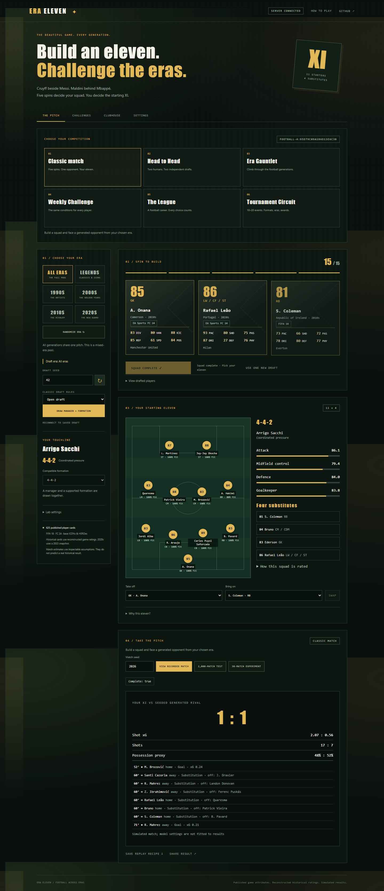

# Era Eleven

Draft football across generations: five spins award three people each, then fifteen people become eleven starters and four usable substitutes under a drawn manager and formation. Play in the browser or inspect and change the same Python game in [Football Era Lab.ipynb](Football%20Era%20Lab.ipynb).



## Play

From this repository folder, using Python 3.11 or later:

```text
python -m pip install -r requirements.txt
python -m pip install -r requirements-analytics.txt
python -m era_eleven.server
```

Open [127.0.0.1:8765](http://127.0.0.1:8765). Change the port with `--port 8766` if it is occupied. On the development machine, use `C:\Python314\python.exe` in place of `python`.

The pinned analytics dependency is optional for the offline game. Without it, the interface labels the identical fixed-rate fallback; event/entity tools require `fas`. Once dependencies are installed, normal gameplay downloads nothing and needs no account or API key.

| Mode | What you play |
| --- | --- |
| Open draft / Salary Cap | Five spins, compatible lineup changes, one match, repeated trials, and one whole-draft practice respin. Salary mode enforces fifteen-card quotas and a game-coin budget. |
| Era Gauntlet | Four fourteen-match segments per era, management choices, then a best-of-seven generated boss. A surviving loss restarts that era with the same people and development. Four forward/reverse maps and accumulated boss attempts are saved. |
| Tournament Circuit | Choose 10–20 events. League, group, knockout, home-and-away aggregate and best-of formats rotate across the supported eras. Tables, qualification, shootouts, goals, clean sheets and trophies determine the outcomes and awards. |
| Weekly Challenge | UTC Monday challenge with a common seed, pool, tier quotas, model/rules version and generated rivals. Best points under matching conditions are retained. |
| The League | Create a fictional football avatar. Make four d20 decisions per fixture, earn XP, train, equip kit, negotiate and change clubs, then save a twenty-level ending or retire with an SVG career card. |
| Head to Head | Two humans, two squads and one neutral football match. Alternate locally or use synchronized private rooms on the same server. Both players vote for a rematch. |
| Mini Games | Daily and unlimited Daily Card, Higher or Lower, 120-second club-roster recall and five-round Country Hunt. Daily progress resumes after reload; minis remain outside competitive rankings. |

The clubhouse saves completed match statistics, achievements, the drafted-card album and separately earned trophy cards. Appearance, backdrops, lineup view, sorting, sound/volume, reveal speed, effects and reduced motion are functional saved settings. Help explains the rules and evidence limits. JSON recipes replay server-owned drafts; imported experiments are unranked.

## Notebook

```text
python -m jupyterlab "Football Era Lab.ipynb"
```

Run all cells, then use `NotebookGame` for the original laboratory or `NotebookModes` for saved competitions, career and local two-human controls. Seeds, datasets, configuration, role weights, random-era weights and weekly rules are editable. The default notebook service is an isolated in-memory experiment; set its SQLite path to persist it. GitHub's preview cannot operate widgets.

The notebook also retains the 38-match season laboratory, substitutions, Monte Carlo uncertainty, sensitivity analysis, imports and optional real-event analysis. A season laboratory is separate from Era Gauntlet and the career.

## Two devices and saved progress

```text
python -m era_eleven.server --host 0.0.0.0 --port 8765
```

On a trusted network, both humans open the host computer's address, create/join a six-character private room, and let the host start. Online players draft simultaneously from independent pools; optional shared-exclusive pools enforce thirty distinct people. The server hides the opponent's cards until both drafts finish, owns the rosters/results and completes remaining picks at the deadline. Local play alternates handovers. Online draft entropy is private to the room, so a public input seed cannot predict the other human's cards; the saved room reproduces its own draft and reconnect state.

SQLite state defaults to ignored `data/local/game.sqlite`; `--state` selects another file. Browser storage keeps bearer credentials for that server's profile and seats. The private profile backup moves those credentials between browsers; public squad/result exports omit them. Rankings and rooms are shared by clients of **this server**, not a hosted global service. Internet deployment needs an operator and HTTPS proxy (`--public-origin` sets its exact origin). Public account matchmaking and Eraball account sync are external services not supplied by this repository.

## Data and analytics

The offline [manifest](data/manifest.json) describes 625 cards representing 551 source identities. The publishers declare CC0. FC 24 ICON/HERO ratings reconstruct legends; FIFA 18 and FC 24 career ratings are edition snapshots. Curated era tags are not contemporaneous historical measurements. Classics lacks a complete independent formation and remains available through Legends and All eras. The pool is a limited male-player subset.

EA/FIFA and PES/eFootball imports retain provider IDs, reviewed identity mappings, attribute mappings, missingness, edition and supplied licences. Similar names never merge people automatically. Keep permitted user exports in ignored local storage. See [DATA_PIPELINE.md](docs/DATA_PIPELINE.md) and [data attribution](data/README.md).

The pinned [football_analytics_system](https://github.com/symonyeal/football_analytics_system) supplies the shared scoring and diagnostic tools through a small adapter. Role fit, tactical and chemistry effects, fatigue, substitutions and game rules remain explicit football assumptions. **Gameplay coefficients are not fitted to real drafted-squad results.** Optional StatsBomb event measurements and fitted historical team assessments are separate. The small 2022 World Cup holdout failed to beat a mean-goals baseline and is not used in gameplay.

Read the [model](docs/MODEL.md), [integration audit](docs/INTEGRATION.md), [feature matrix](docs/FEATURE_MATRIX.md), [reference audit](docs/REFERENCE_AUDIT.md), [validation](docs/VALIDATION.md) and [migration/archive inventory](docs/MIGRATION.md) for the exact boundaries. Generated bosses are labelled; attributable historical club-season rosters remain missing input. The League and Country Hunt disclose their football simplifications. Full Eraball parity is not claimed for inaccessible or unplayed reference branches.

## Check

```text
python -m unittest discover -s tests -v
```

Install the analytics requirements to run its adapter/event/evaluation tests. The CI also checks core gameplay and the notebook without `fas`. Validation covers actual browser workflows, independent clients, reloads, real timer expiry, the editable notebook, constrained coverage and authority rejection paths.

Code is MIT licensed; third-party data retains its own declarations and terms. Original branding, interface and artwork are used. No player portraits, proprietary card artwork, club badges, reference assets or raw StatsBomb events are bundled. This independent fan/research game is unaffiliated with Eraball, EA, FIFA, Konami or StatsBomb.
